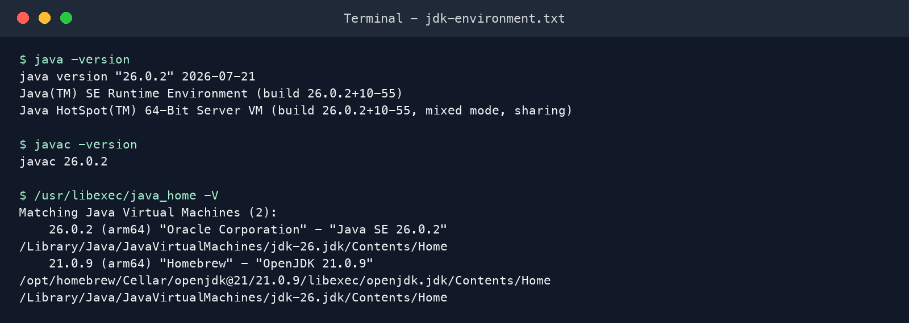
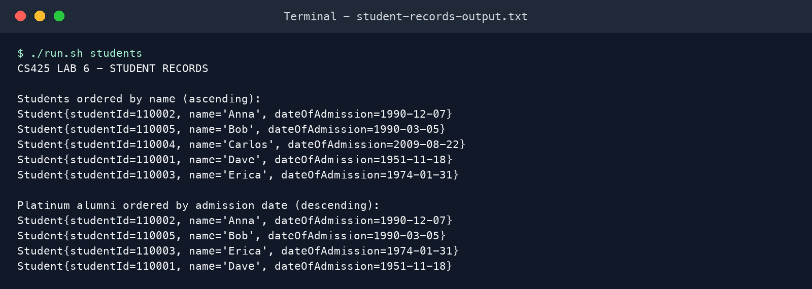
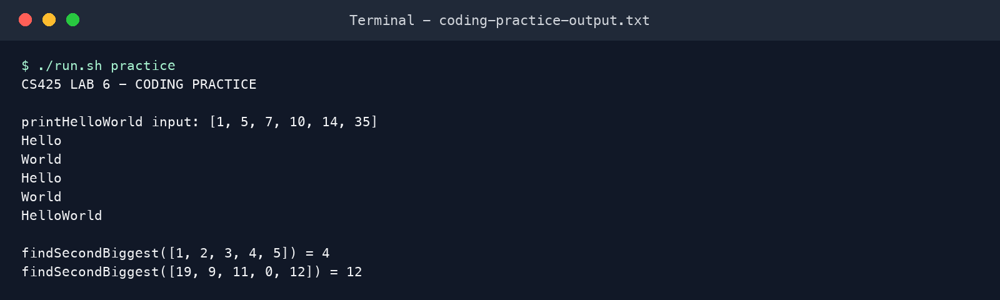
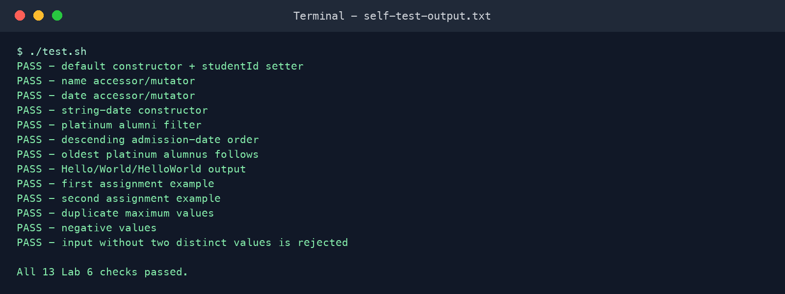

# CS425 Lab 6 - Student Records Management Application

This repository contains the Java command-line application and coding-practice exercises required for CS425 Lab 6.

## Requirements implemented

- `Student` model in `edu.mum.cs.cs425.demos.studentrecordsmgmtapp.model`
- `studentId`, `name`, and `dateOfAdmission` fields
- Three constructors, including the default constructor
- Accessor and mutator methods for every field
- `MyStudentRecordsMgmtApp` executable class in `edu.mum.cs.cs425.demos.studentrecordsmgmtapp`
- Student output ordered by name ascending
- Platinum alumni filtering using the 30-year rule, ordered by admission date descending
- `printHelloWorld(int[])`
- `findSecondBiggest(int[])` implemented without sorting
- Dependency-free automated checks

## Build and run

The scripts compile with `javac --release 8`, so the source and generated bytecode are Java 8 compatible while still running on a newer installed JDK.

```bash
./build.sh
./run.sh all
./test.sh
```

You can run each result group separately:

```bash
./run.sh students
./run.sh practice
```

## Actual verification result

The included self-test checks the constructors, accessors, Platinum Alumni rule and ordering, Hello/World behavior, both required second-biggest examples, duplicate maximum values, negative values, and invalid input. All checks pass in the captured evidence.

## Evidence

Terminal transcripts and rendered screenshots are stored in [`evidence/`](evidence/). The current machine provides OpenJDK 21 and Oracle JDK 26 rather than the assignment's legacy JDK 8/11/13 installation set. Compilation targets Java 8 bytecode using `--release 8`; the environment evidence is intentionally factual and does not claim those legacy JDKs are installed.

### JDK environment



### Student-record exercises



### Coding-practice exercises



### Automated verification



## Repository layout

```text
src/main/java/.../model/Student.java
src/main/java/.../MyStudentRecordsMgmtApp.java
src/test/java/.../Lab6SelfTest.java
build.sh
run.sh
test.sh
capture-evidence.sh
evidence/
docs/
```

## Author

Samson Kitigo - Student ID 618666
